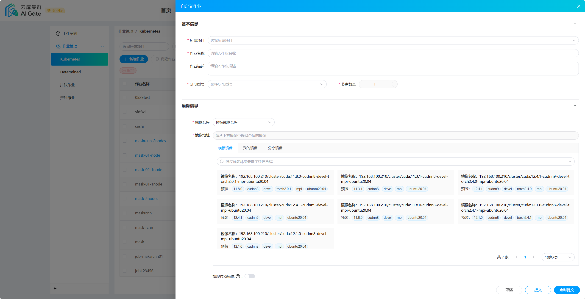
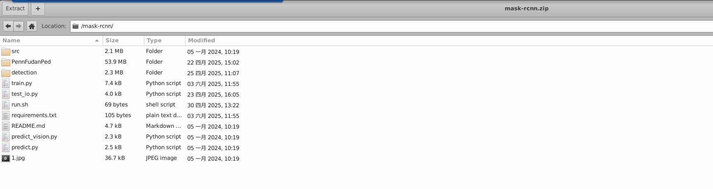
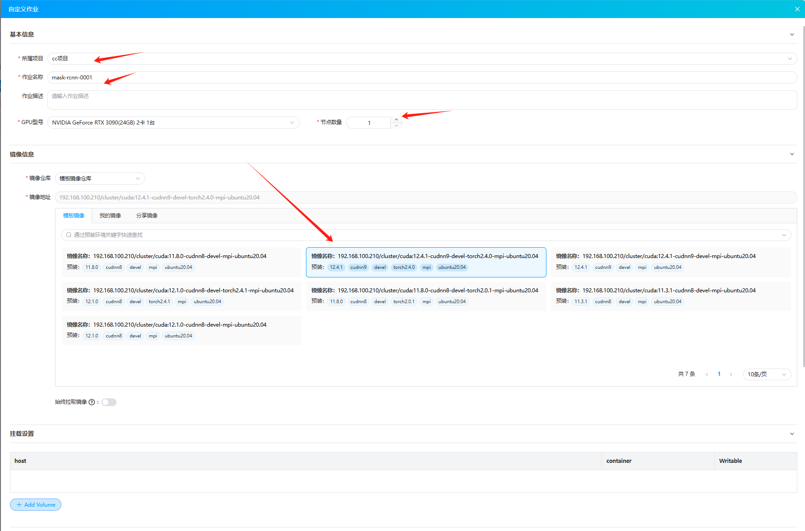
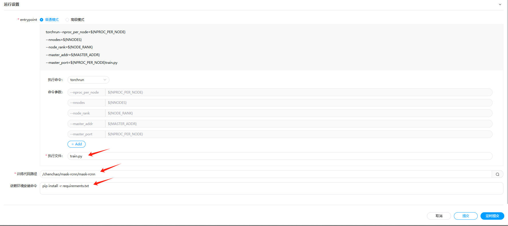

## kubernetes作业介绍

云扉集群提供了多机作业的功能，通过kubernetes进行资源调度，并在作业完成后释放相关资源。目前支持torchrun，后续会支持accelerate，deepspeed等其他方式。

## kubernetes作业引导

### 1.说明

云扉集群的kubernetes作业是多机作业的一种。该模式对机器进行整台的调度，即最少调度一台机器。用户需要理解pytorch的DDP模式方可进行kubernetes作业。不了解DDP的用户可参考[这里]([distribuuuu/tutorial/mnmc_ddp_launch.py at master · BIGBALLON/distribuuuu · GitHub](https://github.com/BIGBALLON/distribuuuu/blob/master/tutorial/mnmc_ddp_launch.py))。

kubernetes作业需要用户正确安装所需要的环境，例如cuda,torch,nccl等。我们在模板镜像中提供了一些可用镜像。当然，用户也可以自己准备镜像，只要符合多机作业的要求即可。

### 2.步骤

* 点击新增作业，选择项目，GPU型号，节点数量（需要调度的机器台数）。选择适合的镜像（需要确保安装对应的环境，例如运行torchrun，需要确保torch及相关环境已经安装，确保至少有一种通信库）；

* 对目录进行挂载，如果需要进行数据挂载，请自行设置；

* 选择可执行的训练代码路径，到可执行文件所在文件夹即可；

* 如果镜像中确实一些依赖，通过依赖环境安装命令补充。

:::note
代码工程一般存放在用户的个人目录中，默认我们将对此目录(训练代码路径)进行挂载，挂载的目标位置容器内部的/root/workdir/。
:::

### 3.示例

我们提供了示例代码工程，在[这里]([dist_job/mask-rcnn.zip at main · caiduoduo12138/dist_job](https://github.com/caiduoduo12138/dist_job/blob/main/mask-rcnn.zip))。请参考如下步骤：

* 上传并解压文件（存储->文件管理->用户名->上传文->解压）

* 选择参数
  
  ::note
  
  * 节点数量是指调度的机器数量；
  
  * 镜像需要包含多机作业的所需的环境；
  
  * 数据集在代码工程中，该示例无需进行挂载设置。若用户自己的代码工程需要进行数据挂载，请自行设置；
  
  * 执行文件是`train.py`
  
  * 训练代码路径需要根据实际情况进行设置，请选择到代码工程的目录（上传的文件目录，该示例为包含train.py的文件夹层级）
  
  * 安装相关依赖，这个在本示例中是，`pip install -r requirements.tx`
    
    :::

* 提交作业
