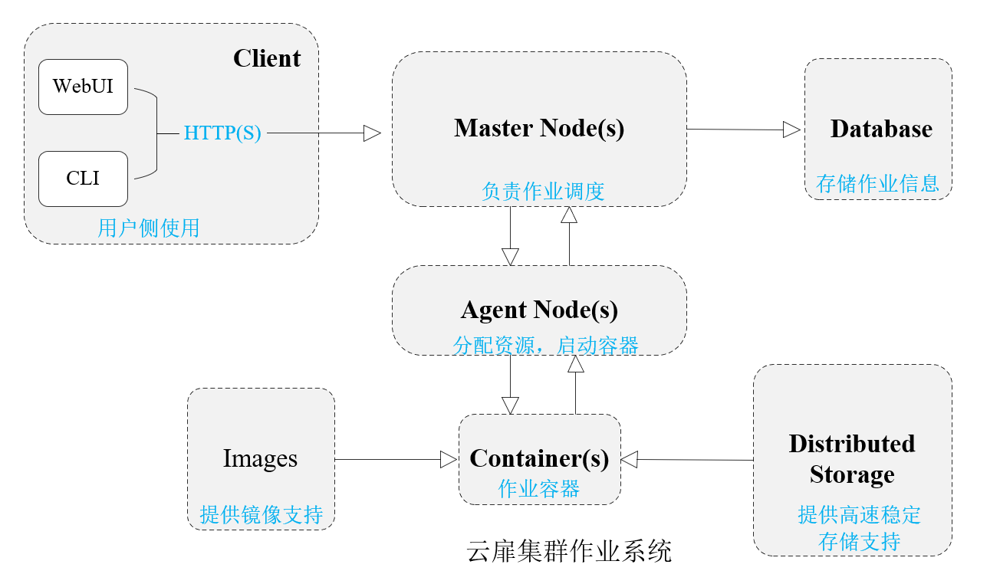
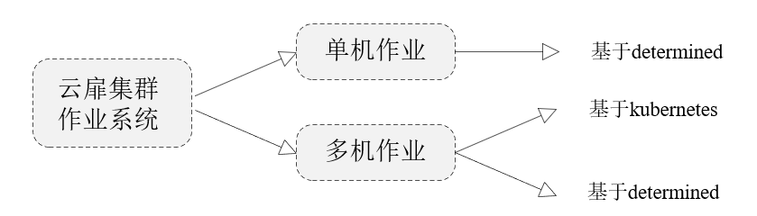

## 核心概念

### 云扉集群作业系统简介

云扉集群的作业系统支持单机单卡、单机多卡、多机多卡的作业调度。在云扉集群中，作业是指用户自定义的、具有生命周期的进程。具有在作业完成后，进程结束并且自动释放资源的特点。

云扉集群的作业系统包含单机作业与多机作业。单机作业运行在集群中的台计算节点，使用shell命令进行调度。多机作业分为：kubernetes多机作业和基于determined调度的多机作业。多机作业可使用pytorch的DDP，accelerate，deepspeed，horovod等框架作为分布式底层调度器，来进行多机多卡的深度学习AI训练任务。如图是作业的整体调度逻辑：


### 云扉集群作业系统的工作流程

云扉集群提供了大量的分布式作业镜像，用户按照自己的需求选择合适的镜像。用户只需要准备作业代码工程和数据集。代码工程和数据集可通过文件管理系统上传。完成镜像选择后，云扉集群会在宿主机上启动相应的作业容器。数据集可通过挂载的方式，映射到作业容器内部。在完成作业后自动回收容器，释放资源。在云扉集群的web页面，用户可进行模型权重的下载与训练日志的查看。

### 为什么使用云扉集群的作业系统

虽然用户的计算任务可以在容器中完成，但是对于集群资源调度还不够灵活方便。云扉集群的作业系统提供了一套资源调度方式，让用户灵活的使用集群中的资源，实现了相关资源的动态申请与释放。此外，多机作业提供了两种模式，以适应不同的用户群体。

下面是云扉集群的一些特性：

- 云扉集群集成了最先进的多机多卡训练技术，提供了大量的分布式作业镜像来进行多机多卡训练任务，减小用户配置深度学习环境花费的时间。

- 云扉集群提供了作业的模板工程，用户只需要按照我们的样例，实现对应的函数，就可以进行多机作业。这使得用户不需要进行分布式框架的一些配置，例如local_rank，rank，通信库等。

- 云扉集群的作业系统支持多个深度学习平台，例如PyTorch、Tensorflow等，内置了MMDetection目标检测框架。

- 此外，云扉集群的作业系统还提供了训练过程可视化(TensorBoard)，日志管理，权重管理，超参数搜索等功能，提高深度学习工程师的研发效率。

### 云扉集群作业详细介绍

云扉集群的作业包含单机作业和多机作业，如图：



单机作业由determined框架提供。对于不了解determined框架的用户也无需担心，您只需要输入`entrypoints`（需要运行的命令），并选择合适的资源（数据挂载，镜像，gpu等）即可。对于了解determined作业的用户，可以自定义代码，通过实现对应的继承类，运行如下命令。更多单机作业介绍请参考我们的[文档]()。

```
python3 -m determined.launch.torch_distributed --trial model_def:MyTrial
```

对于多机作业，分为基于[kubernetes的多机作业]()和[基于determined的多机作业]()。多机作业以整台机器为调度，即跑作业的节点上不能有其他类型的资源占用（容器或者作业）。

对于kubernetes多机作业，用户需要了解至少一种多机多卡的启动方式，例如torchrun，deepspeed，accelerate等。对于determined作业，请参考我们的[文档]()。

* 
